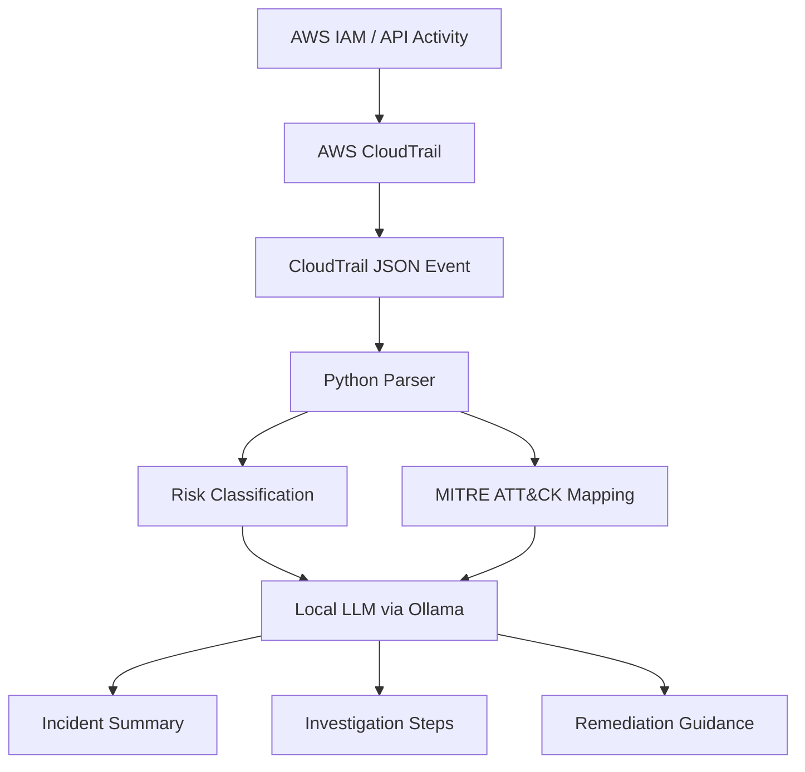

# AI AWS Security Analyzer

An AI-assisted cloud security tool that analyzes AWS CloudTrail events, identifies security-relevant IAM and API activity, maps events to MITRE ATT&CK, and generates analyst-ready investigation and remediation guidance.

## Architecture



## Technologies

- Amazon Web Services (AWS)
- AWS CloudTrail
- AWS IAM
- Python
- Ollama
- Llama 3.2
- Streamlit
- MITRE ATT&CK
- Git
- GitHub

## Features

- Parses AWS CloudTrail JSON events
- Identifies security-relevant AWS API activity
- Classifies events by risk level
- Extracts AWS identity, service, region, and source information
- Maps events to MITRE ATT&CK when appropriate
- Uses a locally hosted generative AI model
- Generates incident summaries
- Generates analyst investigation steps
- Generates remediation recommendations
- Preserves raw CloudTrail JSON for analyst review

## Example

The application analyzed an AWS CloudTrail `CreateServiceLinkedRole` IAM event.

The event was classified as medium risk and flagged for analyst review rather than automatically being labeled malicious.

The AI generated:

- Incident summary
- Security significance
- Investigation steps
- Recommended response
- MITRE ATT&CK assessment

## AI Design

The AI model does not directly modify AWS resources.

Python first extracts structured information from the CloudTrail event. The locally hosted LLM then acts as an analyst-assistance layer by explaining the event and generating investigation guidance.

This keeps security decisions human-reviewed rather than allowing the AI to automatically execute remediation.

## Installation

Clone the repository:

```bash
git clone https://github.com/slokasanampudi/ai-aws-security-analyzer.git
cd ai-aws-security-analyzer
```

Create a Python environment:

```bash
python3 -m venv .venv
source .venv/bin/activate
```

Install dependencies:

```bash
pip install -r requirements.txt
```

Install the local AI model:

```bash
ollama pull llama3.2:3b
```

Run the application:

```bash
streamlit run app.py
```

## Usage

1. Export or copy an authorized AWS CloudTrail event in JSON format.
2. Upload the JSON event to the Streamlit application.
3. Review the parsed AWS security information.
4. Click **Analyze with AI**.
5. Review the generated investigation and remediation guidance.

## Security

CloudTrail examples included in this repository are sanitized before publication.

Real AWS account identifiers and other unnecessary identifying information should not be committed to a public repository.

AI-generated recommendations should always be validated by a security analyst.

## Future Improvements

- Analyze multiple CloudTrail events together
- Detect abnormal IAM activity over time
- Add additional MITRE ATT&CK mappings
- Integrate directly with AWS APIs
- Add automated ServiceNow incident generation
- Add analyst feedback scoring
